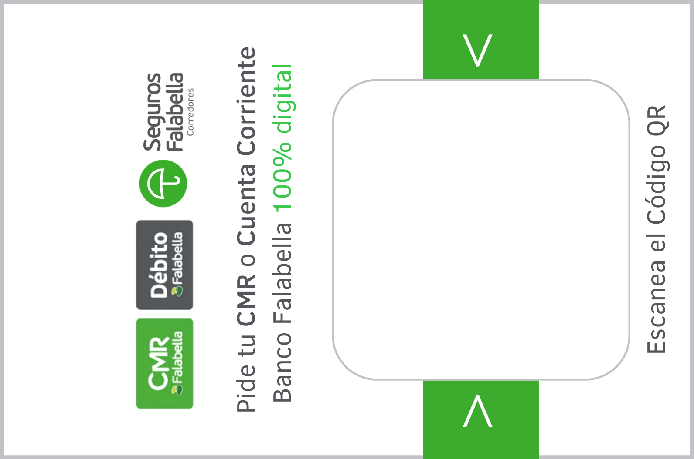

# Generador de Carnet QR · Banco Falabella (beta)

App web para generar un **carnet en PDF** con la tarjeta promocional de Banco
Falabella, insertando un **código QR personalizado** por cliente y su
**nombre y apellido** al pie. Pensado para **imprimir y termolaminar**.



## Qué hace

1. Pides al operador el **RUT** (sin dígito verificador), el **dígito
   verificador / guion (DV)**, el **nombre** y el **apellido**.
2. Genera un **código QR** que apunta a la apertura de cuenta de Banco Falabella.
   En el parámetro `utm_term` de la URL se inserta el **RUT sin guion pero con
   el dígito verificador** (ej: `20.467.285-7` → `utm_term=204672857`).
3. Compone la **tarjeta Falabella** con el QR dentro del recuadro blanco y el
   **nombre y apellido** debajo.
4. **Descarga un PDF** listo para imprimir.

URL base del QR (se reemplaza `utm_term`):

```
https://www.bancofalabella.cl/pre-landing?utm_source=Falabella&utm_medium=QRregional&utm_content=costanera-center-qr-unificado&utm_campaign=apertura-falabella&utm_term=<RUT+DV>&store_id=3660
```

## Tamaño de impresión (importante)

La pieza se genera en **60 × 70 mm**, **menor** que la lámina de termolaminado
**MILITARY de 66 × 102 mm**. Así queda un **borde blanco** alrededor para poder
plastificar/sellar sin cortar el diseño.

- Pieza (PDF): **60 × 70 mm**
- Tarjeta dentro de la pieza: **52 × 34 mm**
- Nombre y apellido: debajo de la tarjeta, en dos líneas, con ajuste automático
  de tamaño.

## Uso

Es un único archivo estático. No requiere servidor ni conexión a internet
(las librerías y la imagen van incrustadas).

- **Local:** abre `index.html` en el navegador (doble clic).
- **Publicado:** sirve `index.html` con cualquier hosting estático o GitHub Pages.

### Validación de RUT

El campo RUT valida el dígito verificador con **módulo 11** y muestra un aviso
si no coincide (no bloquea, solo advierte).

## Desarrollo

`index.html` es un archivo **generado**. Para editar la app, modifica
`src/app_template.html` y vuelve a empaquetar:

```bash
python3 src/build.py
```

Estructura:

```
carnet-qr-falabella/
├── index.html                 # app final autocontenida (generada)
├── README.md
└── src/
    ├── app_template.html      # HTML + estilos + lógica (editable)
    ├── build.py               # empaqueta todo en index.html
    ├── assets/card.png        # plantilla de la tarjeta (extraída del PDF oficial)
    └── vendor/
        ├── jspdf.umd.min.js   # jsPDF 2.5.1
        └── qrcode.min.js      # qrcode-generator 1.4.4
```

## Créditos / librerías

- [jsPDF](https://github.com/parallax/jsPDF) — generación de PDF.
- [qrcode-generator](https://github.com/kazuhikoarase/qrcode-generator) — código QR.

---

> **Versión beta.** Uso interno para apertura de cuentas Banco Falabella.
> Verifica el RUT antes de imprimir. Logos y marcas son propiedad de Falabella.
